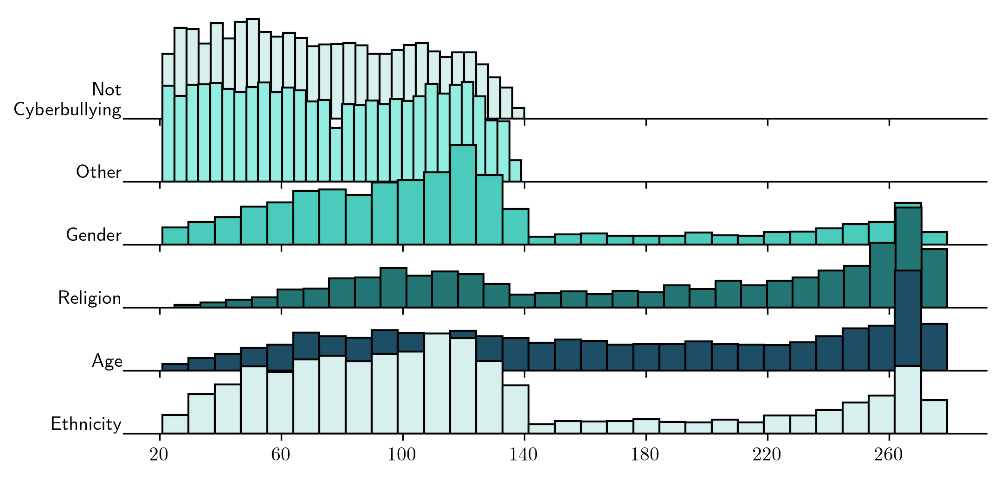
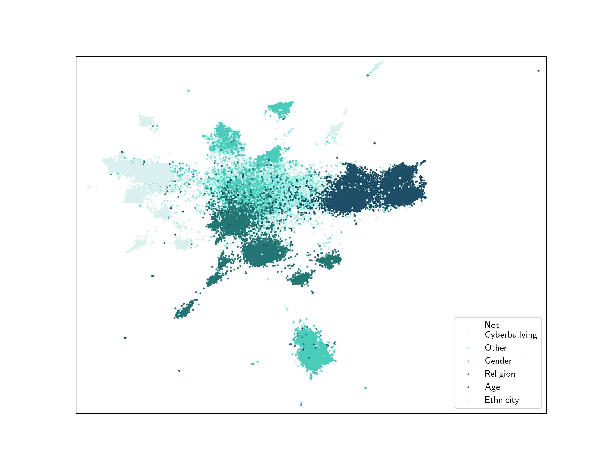

# Cyberbullying Detection
Data Science Capstone Project Spring 2022

 

Ayush Kumar, Elise Karinshak, Lauren Wilkes 

Cyberbullying is a pressing challenge facing modern digital environments. This analysis builds upon previous literature to attempt to detect and classify Twitter content by type of cyberbullying. By focusing on data quality in preprocessing (specifically language detection), we find substantial improvements in model performance; controlling signal quality yielded single digit improvements in accuracy over previous literature in single models. Ultimately, this analysis contributes to methodology relating to Twitter data processing, and proposes future directions for research.

## Dataset Description

The dataset studied is the fine grain cyberbullying detection (FGCD) dataset introduced by Wang
et. al in 2020 [12]. The FGCD dataset was constructed by utilizing online dynamic query expansion to reduce the inherent imbalance in traditional hate speech data-sets. The FGCD dataset [12] contains 47,692 total Tweets and a class label describing the type of cyberbullying (6 levels: "age", "ethnicity", "gender", "religion", "other cyberbullying", and "not cyberbullying").

Natural language classification models rely on the key assumption that a corpus of words comes from a single shared language. Multilingual classification problems require adequate dataset sizes for each language and individualized models. After applying the standard techniques, tweet language was detected
using a python port of langdetect [11]. Analysis of the initial dataset detected 32 languages. To reduce noise non-English observations were removed from the entire dataset. This reduced the overall dataset size from 47,692 tweets to 44,620 tweets.

After preprocessing, the distributions of tweet lengths by class 2 display apparent trends. In 2017, Twitter increased the maximum tweet length from 140 characters to 280 characters. This is why most of the classes display bi-modal distributions with peaks just below 140 and 280 characters. 

Natural language processing suffers from high dimensionality, which makes the data difficult to
visualize. We utilized uniform manifold approximation and projection (UMAP) [7] to embed the TFIDF
document term matrix in 2-dimensions for visualization.

## Models and Results 

The classification models selected for analysis are: logistic regression, support vector machine (SVM), and gradient boosted trees implemented with XGBoost[4]. XLNet [13] was also utilized as a classification model.

|                          | macro f1-score      |accuracy |
|--------------------------------------------------|---------------|-------------------------------|
|BOW+Logistic Regression    | 0.8313        | 0.8527                        |
|BOW+SVM                  | 0.8345        | 0.8540                        |
| BOW+XGBoost                | 0.8454        | 0.8645                        |
| TF-IDF+Logistic Regression| 0.8242        | 0.8473                        |
| TF-IDF+SVM              | 0.8361        | 0.8575                        |
| TF-IDF+XGBoost            | 0.8360        | 0.8559                        |
|XLNet                    | **0.8549** | **0.8763**              |

The results in Table 4 represent a substantial improvement over previous literature in the 6-class classification problem. Ahmed et. al.'s [1] top performing single model was XLNet with a 84.19% accuracy score. Ahmed achieved 90.76% accuracy with an ensemble of 4 transformer architectures, RoBERTa[6], DistilBERT[10], XLNet [13], and BERT [5]. Our worst models outperformed any best single model, but did not match the performance of the transformer ensemble. The BOW models almost always performed better than TF-IDF models.

## References 

[1] Tasnim Ahmed, Mohsinul Kabir, Shahriar Ivan, Hasan Mahmud, and Kamrul Hasan. Am i
being bullied on social media? an ensemble approach to categorize cyberbullying. In 2021
IEEE International Conference on Big Data (Big Data), pages 2442–2453, 2021.

[2] Takuya Akiba, Shotaro Sano, Toshihiko Yanase, Takeru Ohta, and Masanori Koyama. Optuna:
A next-generation hyperparameter optimization framework. In Proceedings of the 25rd ACM
SIGKDD International Conference on Knowledge Discovery and Data Mining, 2019.

[3] James Bergstra, Rémi Bardenet, Yoshua Bengio, and Balázs Kégl. Algorithms for hyperparameter
optimization. In J. Shawe-Taylor, R. Zemel, P. Bartlett, F. Pereira, and K.Q.
Weinberger, editors, Advances in Neural Information Processing Systems, volume 24. Curran
Associates, Inc., 2011.

[4] Tianqi Chen and Carlos Guestrin. XGBoost. In Proceedings of the 22nd ACM SIGKDD
International Conference on Knowledge Discovery and Data Mining. ACM, aug 2016.

[5] Jacob Devlin, Ming-Wei Chang, Kenton Lee, and Kristina Toutanova. Bert: Pre-training of
deep bidirectional transformers for language understanding. arXiv preprint arXiv:1810.04805,
2018.

[6] Yinhan Liu, Myle Ott, Naman Goyal, Jingfei Du, Mandar Joshi, Danqi Chen, Omer Levy, Mike
Lewis, Luke Zettlemoyer, and Veselin Stoyanov. Roberta: A robustly optimized bert pretraining
approach, 2019.

[7] L. McInnes, J. Healy, and J. Melville. UMAP: Uniform Manifold Approximation and Projection
for Dimension Reduction. ArXiv e-prints, February 2018.

[8] Adam Paszke, Sam Gross, Francisco Massa, Adam Lerer, James Bradbury, Gregory Chanan,
Trevor Killeen, Zeming Lin, Natalia Gimelshein, Luca Antiga, Alban Desmaison, Andreas
Kopf, Edward Yang, Zachary DeVito, Martin Raison, Alykhan Tejani, Sasank Chilamkurthy,
Benoit Steiner, Lu Fang, Junjie Bai, and Soumith Chintala. Pytorch: An imperative style, highperformance
deep learning library. In H. Wallach, H. Larochelle, A. Beygelzimer, F. d'Alché-
Buc, E. Fox, and R. Garnett, editors, Advances in Neural Information Processing Systems 32,
pages 8024–8035. Curran Associates, Inc., 2019.

[9] F. Pedregosa, G. Varoquaux, A. Gramfort, V. Michel, B. Thirion, O. Grisel, M. Blondel,
P. Prettenhofer, R. Weiss, V. Dubourg, J. Vanderplas, A. Passos, D. Cournapeau, M. Brucher,
M. Perrot, and E. Duchesnay. Scikit-learn: Machine learning in Python. Journal of Machine
Learning Research, 12:2825–2830, 2011.

[10] Victor Sanh, Lysandre Debut, Julien Chaumond, and ThomasWolf. Distilbert, a distilled version
of bert: smaller, faster, cheaper and lighter, 2019.

[11] Nakatani Shuyo. Language detection library for java, 2010.

[12] Jason Wang, Kaiqun Fu, and Chang-Tien Lu. Sosnet: A graph convolutional network approach
to fine-grained cyberbullying detection. In 2020 IEEE International Conference on Big Data
(Big Data), pages 1699–1708. IEEE, 2020.

[13] Zhilin Yang, Zihang Dai, Yiming Yang, Jaime Carbonell, Ruslan Salakhutdinov, and Quoc V.
Le. Xlnet: Generalized autoregressive pretraining for language understanding. 2019.